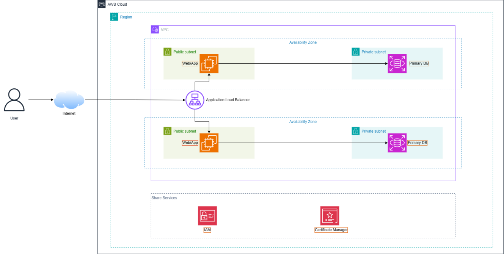

## OBJECTIVES AND ASSIGNED TASKS

* Set up an AWS account and complete 5/5 startup tasks to receive 100 free credits for the upcoming labs.
* Learn how to use the draw.io tool to design system architecture, creating a premise for building data models and distributed infrastructure later.
* Grasp the process of creating an AWS workshop.
* Complete the theoretical part of Module 1, focusing on cost optimization strategies and working with the AWS Support service.

## IMPLEMENTATION PROCESS AND ACCUMULATED KNOWLEDGE

### System Architecture Practice
Applied draw.io to sketch cloud system flows.

**Tutorial Video:** https://youtu.be/l8isyDe-GwY?si=QUQOTtZCJgecLXhJ

### Cost Optimization (FinOps)
Knowledge from Module 1 helped to clearly realize the importance of budget management when operating large data systems. Learned how to set up budget alerts and interact with AWS Support to resolve resource issues.

**Tutorial Videos:**
* https://youtu.be/HxYZAK1coOI?si=bRrC5pBUqpOQ2oRB
* https://youtu.be/IK59Zdd1poE?si=LtBs-k-TAEsLf73h
* https://youtu.be/HSzrWGqo3ME?si=mYtE5xvChtIA1w9w
* https://youtu.be/pjr5a-HYAjI?si=96hVmzvl3ixAteYH
* https://youtu.be/2PQYqH_HkXw?si=sjvkojDP2yfmzlmb
* https://youtu.be/IY61YlmXQe8?si=epkaxcnIDRAtFs-b

### Workshop Setup
Grasped the initialization flow and basic permission granting when running practical resources on AWS.

**Tutorial Video:** https://youtu.be/mXRqgMr_97U?si=uJ_zFiJFnupAUiZj