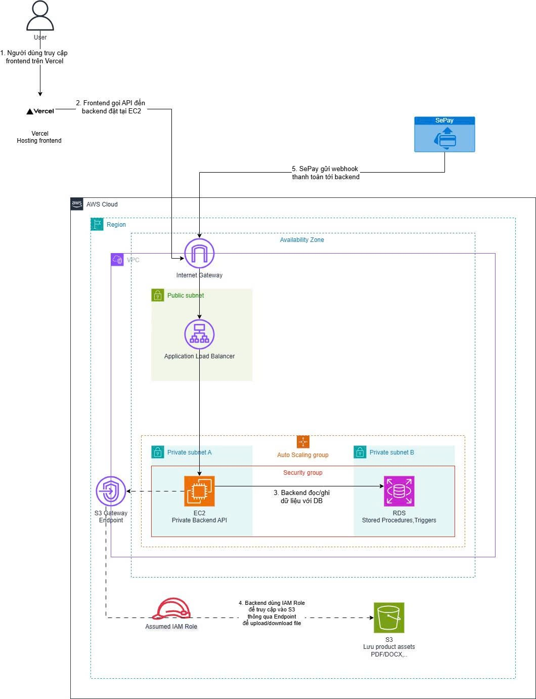

## MỤC TIÊU & NHIỆM VỤ ĐƯỢC GIAO

* Sử dụng công cụ draw.io để thiết kế sơ đồ kiến trúc (Architecture) tổng thể cho toàn bộ dự án trên môi trường AWS.
* Tham vấn ý kiến chuyên môn từ các quản trị viên (admin), thực hiện tinh chỉnh và hoàn thiện bản vẽ.
* Xác định và chuẩn hóa các luồng xử lý giao tiếp giữa Frontend, Backend, Cơ sở dữ liệu và các dịch vụ bên thứ ba.

## QUÁ TRÌNH THỰC HIỆN & KIẾN THỨC TÍCH LŨY

Trong tuần này, việc vẽ kiến trúc không chỉ là thao tác sắp xếp các biểu tượng mà là quá trình tư duy hệ thống. Qua 2 lần đệ trình và chỉnh sửa dựa trên phản hồi của các anh chị admin, tôi đã chốt được kiến trúc cuối cùng với 5 luồng xử lý cốt lõi:

### 1. Xây dựng Vùng đệm Public cho Frontend & API
* **Quá trình thực hiện:** Thiết lập luồng người dùng truy cập từ Frontend (được host độc lập trên Vercel). Mọi yêu cầu gọi API sẽ đi qua Internet Gateway (IGW) và được kiểm soát bởi Application Load Balancer (ALB) nằm tại Public Subnet.
* **Kiến thức tích lũy:** Tôi đã hiểu rõ cách ALB đóng vai trò như một "vùng đệm" (DMZ) an toàn để phân bổ lưu lượng mạng trước khi đi sâu vào hệ thống.

### 2. Bảo mật tuyệt đối cho Khối Compute (Private Network)
* **Quá trình thực hiện:** Thiết lập cụm máy chủ Backend (Node.js/Express) chạy trên EC2 và được tự động co giãn bằng Auto Scaling Group.
* **Kiến thức tích lũy:** Điểm mấu chốt là toàn bộ khối này được giấu kín hoàn toàn bên trong Private Subnet, không có bất kỳ kết nối trực tiếp nào với Internet, đảm bảo tính an toàn tối đa cho trung tâm xử lý logic nghiệp vụ (xác thực, phân quyền, quản lý sản phẩm).

### 3. Tối ưu Hiệu năng xử lý tại Khối Database
* **Quá trình thực hiện:** Phân bổ Amazon RDS PostgreSQL vào một Private Subnet độc lập khác, chỉ cho phép EC2 giao tiếp qua Security Group nội bộ (cổng 5432).
* **Kiến thức tích lũy:** Thay vì đẩy mọi gánh nặng tính toán lên Backend Node.js, nhóm đã tận dụng triệt để sức mạnh của cơ sở dữ liệu bằng cách thiết kế các Stored Procedures và Triggers trực tiếp trên RDS. Cách tiếp cận này giúp xử lý tự động và cực kỳ nhanh chóng các logic đối soát trạng thái đơn hàng phức tạp.

### 4. Thiết lập Đường hầm Nội bộ (VPC Endpoint) cho Storage
* **Quá trình thực hiện:** Lựa chọn Amazon Amazon S3 (chế độ Private) làm nơi lưu trữ các tài sản số (PDF, DOCX, 3D Models).
* **Kiến thức tích lũy:** Để máy chủ EC2 nằm trong Private Subnet có thể tải file an toàn mà không tốn chi phí đi vòng qua NAT Gateway, tôi đã cấu hình S3 Gateway Endpoint để tạo đường hầm mạng nội bộ. Đồng thời, áp dụng chặt chẽ quyền IAM Role cho EC2 để giới hạn truy cập đúng vào các thư mục sản phẩm cần thiết.

### 5. Tự động hóa luồng Webhook Thanh toán
* **Quá trình thực hiện & Kiến thức tích lũy:** Vẽ luồng giao tiếp thời gian thực cho SePay Webhook. Khi có khách hàng thanh toán thành công, tín hiệu từ bên thứ 3 sẽ xuyên qua IGW, qua ALB vào EC2 để trigger logic cập nhật trạng thái đơn hàng và tự động mở khóa quyền tải file số cho người mua.

### Sơ đồ Kiến trúc Tổng thể Đám mây (AWS Architecture)

