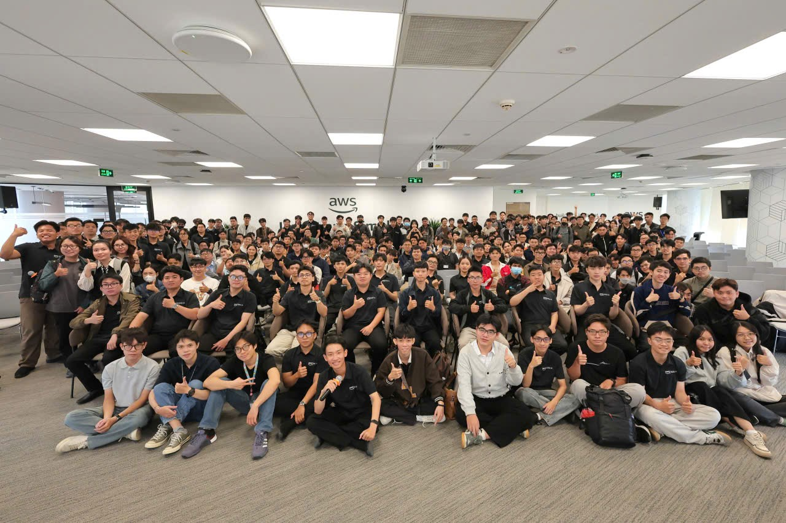

## 1. Thông tin chung về sự kiện

* **Tên sự kiện:** Saturday Meet Up
* **Đơn vị tổ chức:** Bootcamp First Cloud AI Journey (FCAJ)
* **Diễn giả tham gia:** Huỳnh Hoàng Long, Nguyễn Tuấn Thịnh, Đỗ Hoàng Hiếu

## 2. Thể lệ và Hình thức thi đấu

Sự kiện được tổ chức dưới dạng một giải đấu kiến thức về hệ sinh thái đám mây, mang lại không khí cực kỳ hào hứng và kịch tính.
* **Cấu trúc giải đấu:** Có tổng cộng 8 đội tham gia, chia thành 4 cặp đấu loại trực tiếp. Đội giành chiến thắng sẽ bước tiếp vào vòng trong, đội thua sẽ bị loại.
* **Cách thức thi đấu:** Tại mỗi lượt đấu, hai đội phải thảo luận và thống nhất chọn 1 trong 8 bộ đề đã được ban tổ chức chuẩn bị sẵn. Mỗi bộ đề bao gồm 10 câu hỏi xoay quanh các dịch vụ của AWS.
* **Hệ thống tính điểm:** Trả lời đúng sẽ được cộng điểm, trả lời sai sẽ bị trừ số điểm tương ứng của câu hỏi đó (mỗi câu hỏi có trọng số điểm khác nhau tùy độ khó).
* **Quyền trợ giúp:** Yếu tố chiến thuật được đẩy lên cao trào khi mỗi đội có 2 quyền trợ giúp trong một trận:
  * **Giảm thiểu rủi ro:** Bảo toàn điểm số, không bị trừ điểm nếu chẳng may trả lời sai.
  * **Ngôi sao hy vọng:** Nhân đôi số điểm nếu trả lời đúng, nhưng đồng thời sẽ bị trừ gấp đôi số điểm nếu trả lời sai (All-in).

## 3. Diễn biến sự kiện

Trong khuôn khổ sự kiện ngày hôm đó, giải đấu đã diễn ra các loạt trận thuộc vòng Tứ kết và Bán kết. Không khí của các trận đấu vô cùng sôi nổi và căng thẳng khi các đội cạnh tranh nhau từng điểm số một. Việc sử dụng các quyền trợ giúp đã tạo ra những bước ngoặt không thể lường trước:
* Những màn lội ngược dòng ngoạn mục, giành chiến thắng chung cuộc dù bị đối thủ dẫn trước từ sớm.
* Những chiến thuật cực kỳ thông minh khi các đội kích hoạt "Giảm thiểu rủi ro" ở những câu hỏi hóc búa để bảo toàn lợi thế đang có.
* Bên cạnh đó, cũng không thiếu những pha "tự hủy" đầy tiếc nuối khi các đội quyết định chơi "all-in" với "Ngôi sao hy vọng" nhưng không thành công.

Trải qua các vòng đấu căng thẳng, sự kiện đã tìm ra được 2 đội xuất sắc nhất bước vào vòng Chung kết, dự kiến sẽ đối đầu trực tiếp sau 2 tuần nữa.

## 4. Tổng kết và Bài học rút ra (Takeaways)

Việc tham gia và theo dõi giải đấu "Saturday Meet Up" không chỉ là một hoạt động giải trí mà còn mang lại những giá trị chuyên môn rất lớn:
* **Ôn tập kiến thức:** Thông qua các câu hỏi thi đấu, tôi đã có cơ hội hệ thống và ôn tập lại toàn bộ các kiến thức về hạ tầng đám mây đã được học trong các module của chuỗi video Bootcamp.
* **Hiểu thêm về tính ứng dụng thực tế (Use Cases):** Xuyên suốt sự kiện, các diễn giả đã chia sẻ rất nhiều ví dụ thực tiễn về cách các doanh nghiệp đang vận hành trên AWS. Trong đó, tôi đặc biệt ấn tượng và ghi nhớ hai case study tiêu biểu:
  * Hệ thống kiến trúc AWS được áp dụng trong nền tảng của một hãng xe ô tô.
  * Cách luồng dữ liệu đám mây hỗ trợ vận hành cho một hệ thống dự báo thời tiết phức tạp.

Đây là một sự kiện cực kỳ bổ ích, giúp tôi củng cố cả về lý thuyết nền tảng lẫn góc nhìn thực tiễn trước khi bắt tay vào triển khai dự án cuối khóa.

### Hình ảnh khi tham gia sự kiện:

