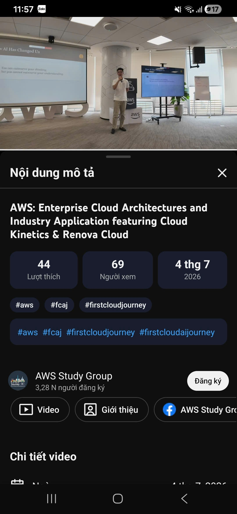

## 1. Thông tin chung về sự kiện

* **Tên sự kiện:** Enterprise Cloud Architectures and Industry Application featuring Cloud Kinetics & Renova Cloud
* **Đơn vị tổ chức:**  Bootcamp First Cloud AI Journey (FCAJ)
* **Diễn giả tham gia:** Nguyễn Gia Hưng, Khang Nguyễn, Như Trần, Vỉnh Bành
* **Vai trò trong sự kiện:** Người tham dự

## 2. Hình thức và Tổng quan sự kiện

Sự kiện được tổ chức dưới dạng một buổi hội thảo chuyên sâu trực tuyến nhằm giới thiệu, định hướng và chia sẻ kinh nghiệm làm việc thực tế của các chuyên gia trong ngành điện toán đám mây và kiến trúc dữ liệu. Không đi theo lối mòn lý thuyết, sự kiện tập trung vào việc bóc tách khoảng cách giữa năng lực học đường với kỳ vọng thực tế của doanh nghiệp, giúp sinh viên hiểu rõ cách thị trường lao động đánh giá và lựa chọn nhân tài.

## 3. Diễn biến và nội dung chi tiết 

Xuyên suốt buổi livestream, các diễn giả đã lần lượt mổ xẻ các khía cạnh từ kỹ thuật chuyên môn, kỹ năng mềm cho đến tâm thế nghề nghiệp một cách vô cùng trực quan:

### Tư duy Kỹ thuật thực chiến và "Phần chìm của tảng băng" (Diễn giả: Vỉnh Bành)
Là một sinh viên Công nghệ thông tin hướng tới mảng dữ liệu và hệ thống, tôi đặc biệt ấn tượng với phần chia sẻ của anh Vỉnh Bành, một Kỹ sư dữ liệu (Data Engineer). Anh đã hệ thống hóa sự khác biệt giữa năng lực học đường và thực tế sản xuất:

* **Nền tảng sinh viên đang có (The Foundation):** Anh Vỉnh thừa nhận các trường đại học đã trang bị rất tốt phần khung kiến trúc nền tảng cho sinh viên bao gồm: Cơ sở dữ liệu & Mô hình hóa dữ liệu, Lập trình & Kỹ nghệ phần mềm, Cấu trúc dữ liệu & Giải thuật, Hệ thống phân tán và API.
* **Thực trạng làm đồ án (Where you are NOW - Tư duy Đồ án):** Sinh viên hiện tại đang sống trong vùng an toàn với các đặc điểm: làm việc trên các bộ dữ liệu sạch (Clean Datasets) chỉ vài trăm dòng; mọi yêu cầu được định nghĩa rõ ràng ngay từ ngày đầu tiên; có vài tháng để thong thả hoàn thiện dự án; và nếu xảy ra sai sót kỹ thuật thì cái giá phải trả chỉ là mất vài điểm số trong học bạ.
* **Thực tế khốc liệt bên ngoài (What's waiting OUTSIDE - Tư duy Sản xuất):** Khi bước ra môi trường doanh nghiệp lớn, hệ thống thực tế phải đối mặt với: Dữ liệu bị khuyết thiếu (Missing values), trùng lặp dữ liệu lớn, định dạng không nhất quán giữa các hệ thống cũ và mới, schema (cấu trúc dữ liệu) thay đổi liên tục, dữ liệu đổ về từ nhiều nguồn khác nhau. Các sự cố phát sinh (Production Incidents) sẽ lập tức gây mất doanh thu và khiến các bên liên quan (Stakeholders) không hài lòng.
* **Mô hình Tảng băng trôi (The Iceberg - Tutorial vs. Production):** Một dự án làm theo hướng dẫn (Tutorial Project) chỉ chiếm **10% phần nổi trên mặt nước** (viết API cơ bản, làm UI, setup DB đơn giản). **90% phần chìm dưới mặt nước** mới là rào cản thực sự mà doanh nghiệp cần kỹ sư giải quyết:
  * Quản lý luồng dữ liệu (Data Orchestration) khi cấu trúc thay đổi liên tục.
  * Đảm bảo tính toàn vẹn dữ liệu trong môi trường giao dịch cao tải.
  * Cấu hình bảo mật nâng cao, vận hành hệ thống theo quy chuẩn DevOps và FinOps.
  * **Bài học cốt lõi:** Việc biết sử dụng công cụ (Knowing Tools) không đồng nghĩa với việc biết xây dựng hệ thống (Building System). Công cụ có thể thay đổi liên tục, nhưng tư duy kiến trúc và kỹ năng quản trị sự đánh đổi mới là thứ ở lại.

### Tâm thế làm việc, Tiêu chí đánh giá và Vòng tròn sự nghiệp (Diễn giả: Như Trần)
Phần chia sẻ của chị Như Trần chủ yếu tập trung vào việc chuẩn bị tâm lý, vượt qua nỗi sợ hãi để bước ra khỏi vùng an toàn khi tham gia vào thị trường lao động.

### Quy tắc kỹ thuật sống còn và Lời giải cho nỗi sợ phụ thuộc AI (Diễn giả: Khang Nguyễn)
* **Thay đổi bản chất trong tư duy (Observation):** Anh đưa ra một so sánh rất đắt giá về ranh giới giữa hai môi trường:
  * **Đi học:** "Trả tiền để có quyền được làm sai" (Nhà trường thu học phí để dạy và sửa sai cho sinh viên).
  * **Đi làm:** "Được trả tiền để không làm sai" (Doanh nghiệp trả lương để nhận lại sự chuẩn xác và hiệu quả).
* **Mô hình 5 tiêu chí doanh nghiệp đánh giá bạn (How Companies Evaluate You):** Anh Khang làm rõ rằng kiến thức kỹ thuật chỉ là một phần nhỏ, doanh nghiệp đánh giá một ứng viên dựa trên 5 tầng:
  1. **Thái độ (Attitude):** Tư duy, sự nhiệt huyết và tinh thần sẵn sàng đón nhận thử thách.
  2. **Trình độ (Competence):** Bằng cấp chuyên môn và kỹ năng kỹ thuật cứng.
  3. **Kinh nghiệm (Experience):** Lịch sử thực hiện công việc và các dự án đã qua.
  4. **Trải nghiệm (Exposure):** Độ rộng và độ sâu của thế giới quan và môi trường làm việc đã cọ xát.
  5. **Tố chất (Potential):** Phẩm chất thiên bẩm và năng lực phát triển dài hạn trong tương lai.
* **5 Giá trị của việc đi làm (The 5 Benefits of Work):** Anh Khang nhắc nhở sinh viên đi làm không chỉ vì lương (Salary) mà còn vì: Kinh nghiệm (Phát triển kỹ năng), Mạng lưới quan hệ (Network), Kiến thức chuyên ngành sâu sắc (Knowledge), và Sự trưởng thành của bản thân (Growth).
* **Mô hình 3 vòng tròn sự nghiệp (The 3 Circles):** Để đạt được sự viên mãn trong sự nghiệp, chúng ta phải tìm được điểm giao thoa của 3 vòng tròn: Việc bạn thích làm (Đam mê), Việc mang lại lợi ích tốt cho bạn (Phúc lợi/Sức khỏe) và Việc bạn phải làm (Trách nhiệm xã hội/Nghĩa vụ chuyên môn).

Anh Khang Nguyễn nhấn mạnh các quy tắc: Kiến thức nền tảng là quan trọng nhất, mọi sự đánh đổi công nghệ đều có chi phí, và giao tiếp bản chất là một kỹ năng kỹ thuật cốt lõi để phối hợp hệ thống.

Một điểm sáng cực kỳ đặc biệt trong phần Q&A của anh Khang là câu hỏi của một bạn học viên về việc **bị phụ thuộc vào AI**. Bạn ấy lo lắng rằng việc dùng AI hỗ trợ làm việc khiến bạn ấy cảm thấy mình "kém thông minh đi" và bất an về năng lực cá nhân. Anh Khang đã mổ xẻ bài toán này thông qua bảng so sánh vai trò tường minh:
* **Những phần việc AI đang ngày càng làm tốt hơn (AI Gets Better At):** Viết các đoạn mã SQL, tự động sinh mã nguồn (Generating code), tạo các dashboard trực quan hóa dữ liệu cơ bản và viết tài liệu hướng dẫn (Documentation).
* **Những phần việc Kỹ sư luôn là người làm chủ (Engineer Still Own):**
  * Thấu hiểu sâu sắc bài toán nghiệp vụ phức tạp của doanh nghiệp (Understanding business problems).
  * Thiết kế kiến trúc tổng thể toàn hệ thống an toàn và tối ưu (Designing architectures).
  * Đưa ra các quyết định đánh đổi về mặt công nghệ và chi phí (Making trade-offs).
  * Giao tiếp, kết nối và đồng bộ luồng công việc giữa các phòng ban (Communication & alignment).
* **Bài học cốt lõi:** AI không thay thế con người, nó chỉ thay thế phần thực thi lặp đi lặp lại. Tư duy kiến trúc, năng lực giải quyết bài toán nghiệp vụ và kỹ năng giao tiếp hệ thống mới là "thánh địa" bất khả xâm phạm của người kỹ sư.

## 4. Tổng kết và Bài học rút ra (Takeaways)

Dù phần lớn các câu hỏi trong mục Q&A của sự kiện khá quen thuộc và thường gặp ở các hội thảo tại trường đại học, nhưng góc nhìn thực chiến về "90% phần chìm của tảng băng hệ thống" và vị thế của người kỹ sư trước làn sóng AI đã mang lại cho tôi những bài học định hướng rất sâu sắc. Nó giúp tôi nhận ra rằng, để trở thành một Data Analyst hay Kỹ sư hệ thống chuyên nghiệp, việc chỉ biết sử dụng công cụ hay ghi nhớ cú pháp lệnh là chưa đủ. Tôi cần tập trung cao độ vào tư duy thiết kế kiến trúc, hiểu sâu bài toán kinh doanh của doanh nghiệp, làm chủ các quyết định đánh đổi công nghệ và rèn luyện một thái độ làm việc chuyên nghiệp, chịu trách nhiệm tối đa với hệ thống mình xây dựng.

### Hình ảnh tham gia event (xem livestream trên kênh Youtube AWS Study Group):
